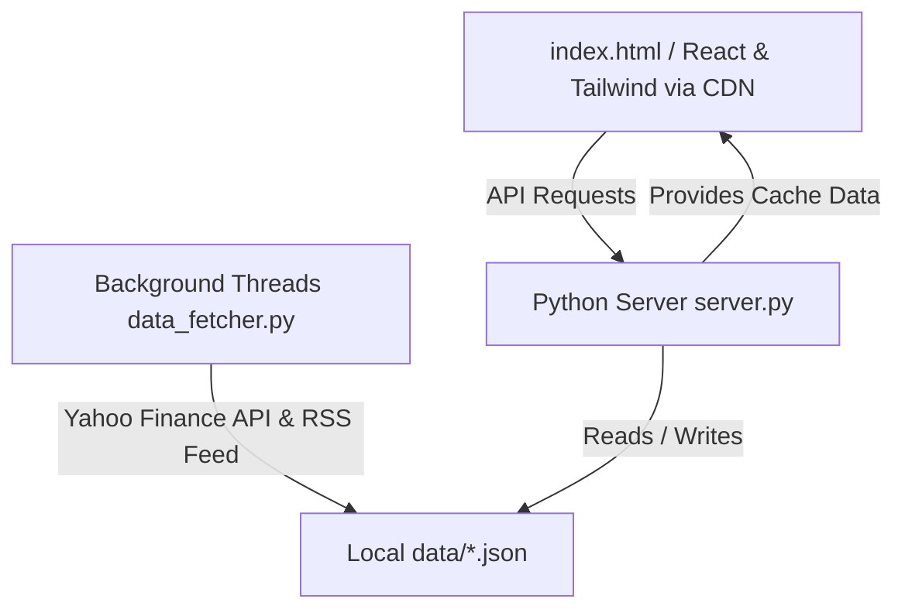

# Master Macro Analysis Dashboard 📊✨

A professional, real-time macro-economic and financial analysis terminal designed for modern asset allocation, risk tracking, and portfolio decision support. Built with a lightweight, high-performance zero-dependency frontend and a pythonic background data engine.

---

## 🚀 Key Features

### 1. Live Statistical Showcases & Market Indicators
- **Real-Time Prices:** Tracking Gold (USD & INR), Silver, WTI Crude Oil, Nifty 50, Sensex, DXY, US 10-Year Bond Yields, S&P 500, Nasdaq, Bitcoin, and major megacap AI stocks.
- **Computed Ratios:** Real-time updates for Gold/Silver Ratio and Nifty/Gold Ratio (per gram calculations adjusted for custom duties and premiums).

### 2. Multi-Horizon Scenario Playbooks (2026 vs 2030)
- Interactive tabbed playbooks for switching view horizons between current situation and 2030 predictions across Gold, Silver, Nifty 50, Nifty 500, and Nasdaq.

### 3. Smart Money Insights & Macro Heatmaps
- Real-time tracking of institutional flow (Bonds, Gold, Stocks, Real Estate, Cash).
- 5 structural bubble risk factor matrices with an automated overall system status verdict.

### 4. Global Notes Sync (Voice, Audio, Links)
- Accessible note-taking directly from the main header.
- Features **Voice Capture/Transcription** converting voice notes to English text.
- Automatically saves synced notes to local memory and bridges directly with Google Docs API logs.

---

## 🛠️ Architecture & Tech Stack



- **Frontend:** React 18, Recharts (vibrant gradients, interactive tooltips), Tailwind CSS, Babel Standalone (zero-build CDN compilation).
- **Backend:** Lightweight Python `socketserver` serving static files, serving REST API endpoints, and orchestrating multithreaded periodic data fetchers (`data_fetcher.py`).
- **Data Engine:** Powered by `yfinance` with intelligent fallbacks.

---

## 📦 Setup & Installation

### Prerequisites
- Python 3.8+ installed on your system.

### 1. Clone the repository
```bash
git clone https://github.com/charanjeetsingh0123-star/AI_Finance_Dashbaord.git
cd AI_Finance_Dashbaord
```

### 2. Install dependencies
```bash
pip install -r requirements.txt
```

### 3. Run locally
```bash
python server.py
```
*The local server automatically spins up at `http://localhost:8000`.*

---

## 🌐 Cloud Deployment (Docker)

This repository includes a `Dockerfile` pre-configured to run headlessly on port `7860` for compatible hosting platforms like **HuggingFace Spaces** or **Render**.

```dockerfile
# To build container locally:
docker build -t macro-dashboard .
docker run -p 7860:7860 macro-dashboard
```
